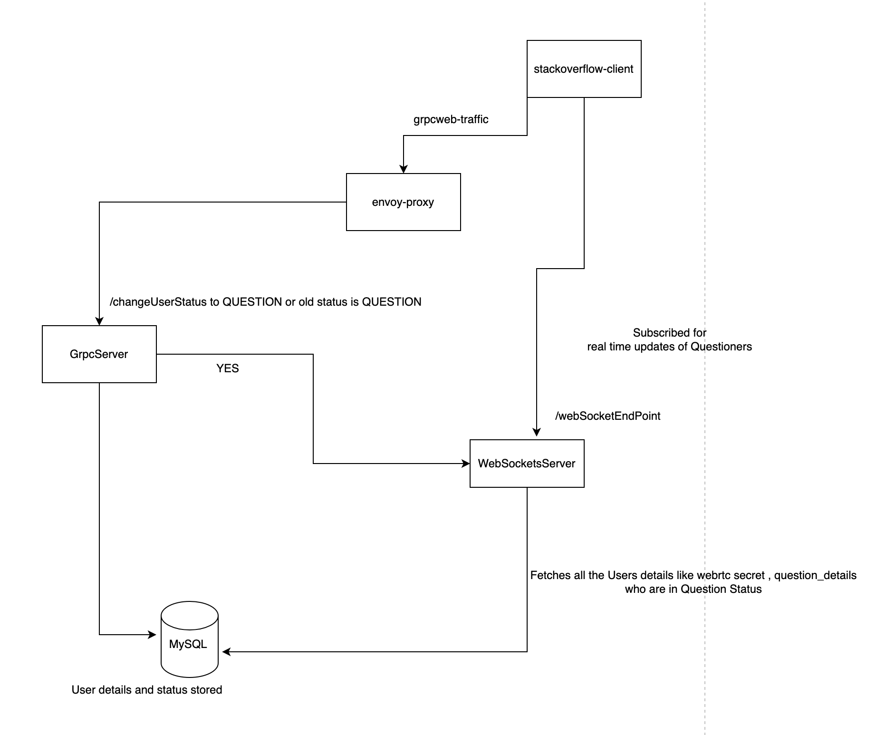

# stackoverflow-client

## Description
An remote peer to peer application where users can ask questions or answer questions implemented by using WebRTC and WebSockets.

### TechStack

| **Component**        | **Technology**                      |
|-----------------------|-------------------------------------|
| Frontend              | React, grpc-web, Docker             |
| GrpcServer            | protobuf, grpc, Spring Boot, Docker |
| WebSocketsServer      | NodeJS                              |
| Database              | MySQL                               |

## Components Overview

### Database 

MySQL database stores details of users in 3 tables as follows

Users(id,username,password,description,refreshToken,rating)

Skills(user_id,skill_id,skill_difficulty)

Live_users(user_id,user_status,webrtc_secret,question_details)

user_status takes values of enums as follows

| Value | State      |
|-------|------------|
| 0     | INACTIVE   |
| 1     | ACTIVE     |
| 2     | QUESTION   |
| 3     | ANSWER     |
| 4     | CALL       |

### WebSockets Server

A NodeJS server for giving live updates of Questions being asked to the users in ANSWER state 

| **Endpoint**            | **Description**                                                                                         |
|-------------------------|---------------------------------------------------------------------------------------------------------|
| Websockets endpoint     | Subscribed by users wanting live updates of questions.                                                  |
| `/userAdded` endpoint   | A REST endpoint protected by an `API_KEY`. It's called by a gRPC server when a user's status changes to or from "QUESTION." This endpoint emits an event to all users subscribed to the Websockets endpoint for live updates. |

### GrpcServer 
A grpc server implemented in Java using Spring Boot , Contains endpoints like /signUp , /login , /changeUserStatus , /checkToken , /getToken , /logout

Implemented Authentication using JWT tokens and encrypted the passwords using bcrypt library.
Makes a call to WebSockets Server when a user status is changed from QUESTION or to QUESTION

### Envoy-proxy

An envoy-proxy for handling incoming grpc-web traffic from the frontend Application to GrpcServer

### stackoverflow-client

The frontend React application which makes calls to GrpcServer through Envoy-proxy.

